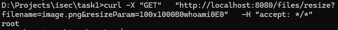
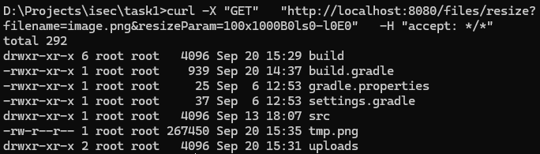

# OS command injection

Внедрение команд ОС также известно как внедрение команд оболочки (shell injection). Оно позволяет злоумышленнику выполнять команды операционной системы (ОС) на сервере, на котором запущено приложение, и, как правило, полностью скомпрометировать приложение и его данные. Часто злоумышленник может использовать уязвимость внедрения команд ОС для компрометации других частей хостинговой инфраструктуры и эксплуатации доверенных отношений, чтобы развить атаку на другие системы внутри организации.

Данный метод выполняет преобразование изображения с помощью комманды convert, однако в качестве параметра -resize можно передать любую строку, что позволяет через него выполнить любую команду.

```java
@GetMapping("/files/resize")
    public ResponseEntity<Resource> resizeFile(@RequestParam String filename, @RequestParam String resizeParam) throws IOException {
        Path filePath = Paths.get(UPLOAD_DIR).resolve(filename).normalize();
        Path uploadDir = Paths.get(UPLOAD_DIR).toAbsolutePath().normalize();
        
        log.info("uploadDir: {}", uploadDir);
        log.info("filePath: {}", filePath);

        if (!filePath.startsWith(uploadDir)) {
            return ResponseEntity.badRequest().build();
        }

        if (!Files.exists(filePath)) {
            return ResponseEntity.notFound().build();
        }

        String contentType = Files.probeContentType(filePath);
        if (contentType == null) {
            contentType = MediaType.APPLICATION_OCTET_STREAM_VALUE;
        }

        String newPath = filePath.toString() + ".mut.png";
        String command = "convert " + filePath.toString() + " -resize " + resizeParam + " " + newPath;
        log.info("Command: {}", command);

        Process process = new ProcessBuilder("/bin/sh", "-c", command).start();
        StringBuilder output = new StringBuilder();
        try (BufferedReader reader = new BufferedReader(new InputStreamReader(process.getInputStream()))) {
            String line;
            while ((line = reader.readLine()) != null) {
                log.info("Process output: {}", line);
                output.append(line).append(System.lineSeparator());
            }
            int exitCode = process.waitFor();
            log.info("Process finished with exit code: {}", exitCode);
        } catch (InterruptedException e) {
            log.error("Command: {}, interrupted {}", command, e.getMessage());
        }

        Resource resource = new FileSystemResource(newPath);

        return ResponseEntity.ok()
                .contentType(MediaType.parseMediaType(contentType))
                .body(resource);
    }
```

Вставка команд в запрос и добавление '>' для получения файла вывода назад:

> whoami

```bash
curl -X 'GET' \
  'http://localhost:8080/files/resize?filename=image.png&resizeParam=100x100%20%3B%20whoami%20%3E%20' \
  -H 'accept: */*'
```



> ls

```bash
curl -X 'GET' \
  'http://localhost:8080/files/resize?filename=image.png&resizeParam=100x100%20%3B%20ls%20-l%20%3E%20' \
  -H 'accept: */*'
```



Исправление:

> Проверка передаваемого параметра на соответствия шаблону

```java
if (!resizeParam.matches("\\d+x\\d+[!<>^@%]*")) {
    return ResponseEntity.badRequest().build();
}
```

> Более безопасное построение команды вместо передачи чистой строки

```java
ProcessBuilder pb = new ProcessBuilder(
    "convert",
    filePath.toString(),
    "-resize", resizeParam,
    newPath
);
```
